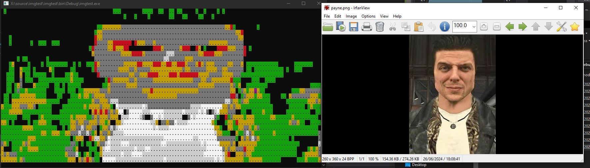

# ImgToConsole
An Image Console Rendering algorhythm

based on Magick.NET (an image handling library)

# Requirements
.Net 4.0 or newer

# What is this library for?
This library adds image rendering functionality to dotnet console apps

# Notes
sadly the images are low quality due 2 the fact that one space in a console != 1 pixel which sucks

# example

</img>
